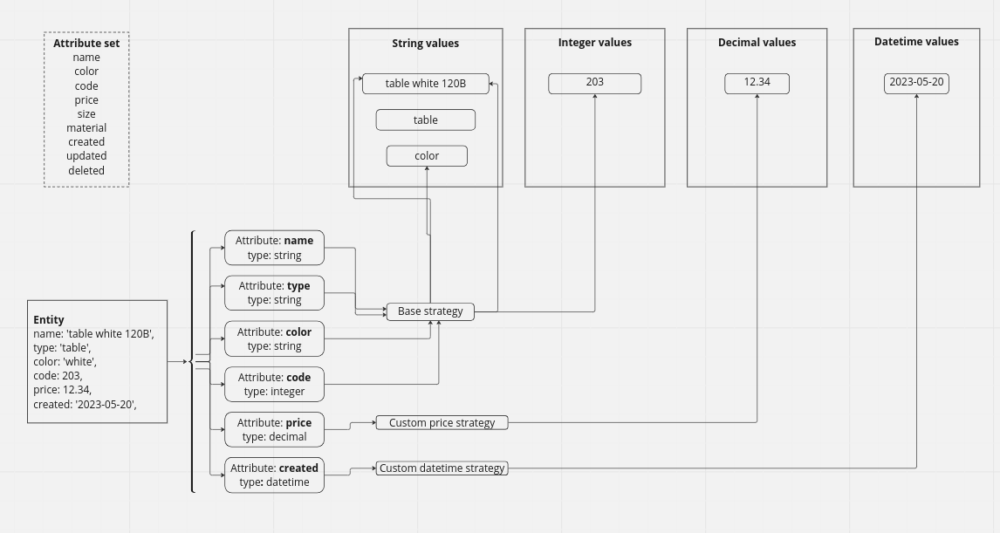

### Table of Contents
- <a href="#common">Common</a>
    - <a href="#connection">Connection</a>
- <a href="#objects">Objects</a>
    - <a href="#domain">Domain</a>
    - <a href="#entity">Entity</a>
    - <a href="#attribute-set">Attribute set</a>
    - <a href="#attribute-group">Attribute group</a>
    - <a href="#attribute">Attribute</a>
    - <a href="#attribute-container">Attribute container</a>
    - <a href="#attribute-strategy">Attribute strategy</a>
    - <a href="#attribute-set-action">Attribute set action</a>
    - <a href="#value">Value</a>
    - <a href="#pivot">Pivot</a>
- <a href="#factory">Factory</a>
    - <a href="#eav-factory">Eav factory</a>
    - <a href="#entity-factory">Entity factory</a>

## Common

The image illustrates a simplified process for creating a new entity.


[Link to diagram](https://miro.com/app/board/uXjVMDWBzBU=/?share_link_id=625279004139)

### Connection
EAV engine relies on a database connection and utilizes PDO php extension for establishing connections.<br />
No pre-configured connection information is available. <br /> 
To set up a connection, need to follow these steps:

1. Define the PDO connection on top of the EAV engine.
2. Feed PDO instance to Connection::get($pdo), it's static and will be used in the EAV engine.
```php
#connection.php
use Drobotik\Eav\Database\Connection;
$pdo = new PDO()
$connection = Connection::get($pdo)
if ($connection->get() instanceof PDO)
    echo 'defined';
```
Choose a [driver](https://www.doctrine-project.org/projects/doctrine-dbal/en/latest/reference/configuration.html#driver) that best suits your requirements.

### Entity

The Entity model is a robust CRUD model that simplifies working with the EAV (Entity-Attribute-Value) data structure. It serves as the primary model for working with individual data records, making it well-suited for single record operations. However, it is not recommended for bulk usage or performing operations on a large number of records simultaneously.

```php
use Drobotik\Eav\Entity;

$entityKey = 1;
$domainKey = 2;
$attributeSetKey = 3;

$entity = new Entity();

// SETUP
$entity->setDomainKey($entityKey);
$entity->setKey($domainKey);
$entity->getAttributeSet()->setKey($attributeSetKey)

// FIND
$result = $entity->find();
$data = $result->getData();

$fields = $entity->getBag();
// EDIT record attributes
$fields->setField('name', 'Tom');
$fields->setField('type', 'Jerry');
// remove record attribute value
$fields->removeField('age');
// it will be ignored since there are no attributes in the attribute set.
$fields->setField('not_existing_attribute', '');

// VALIDATE
// validate attributes and values
$result = $entity->validate(); // result from laravel validator 

$result->getData(); // validation array
$result->getCode(); // just for internal use
$result->getMessage(); // human message

// SAVE
// before-save hooks for attribute strategy
// values will be inserted, updated, or deleted
// after-save hooks for attribute strategy
$entity->save();

// DELETE
// entity with corresponded values will be deleted
$entity->delete();

```
Entity create (without $entity->setKey())
```php
use Drobotik\Eav\Entity;

$domainKey = 2;
$attributeSetKey = 3;

$entity = new Entity();

// SETUP
$entity->setDomainKey($entityKey);
$entity->getAttributeSet()->setKey($attributeSetKey);
$fields = $entity->getBag();
$fields->setField('name', 'Tom');
$fields->setField('type', 'Cat');

$entity->save();
```
Other features
```php
use Drobotik\Eav\Entity;
use Drobotik\Eav\AttributeSet;
    
/* Override attributeSet */
$entity = new Entity();
$attrSet = new AttributeSet();
$entity->setAttributeSet($attrSet);

/* CRUD gnome doing all routine jobs for 'Entity' */
$gnome = $entity->getGnome();

/* toArray */
$entity->toArray(); 
```
More examples:<br>
tests/Eav/Entity/[EntityAcceptanceTest.php](https://github.com/drobotik/eav/blob/master/tests/Eav/Entity/EntityAcceptanceTest.php)

### Attribute set

This class serves as a wrapper for Attribute Containers and is an integral part of Entity.
```php

use Drobotik\Eav\Entity;
use Drobotik\Eav\AttributeSet;
use Drobotik\Eav\AttributeContainer;

$attributeSetKey = 1;

$set = new AttributeSet();
$set->setKey($attributeSetKey);
/* 
 * Making a new database query to retrieve corresponding attributes.
 * Initializing the Attribute containers
 * Initializing Attribute, Strategy, Value, and other objects
 * Retrieving values from the database if they exist
 */
$set->fetchContainers();

/* 
 * It is possible to force the rebuilding 
 * of all Attribute container arrays from scratch
 */
$set->fetchContainers(true);

/* 
 * Other methods
 */
$set->hasContainer('test');
$set->getContainer('test');
$set->pushContainer(new AttributeContainer());
$set->getContainers(); // AttributeContainer[] keyBy name
$set->resetContainers(); // []
$set->setEntity(new Entity());
$set->getEntity(); // Entity
```

### Attribute group

Attribute groups are utilized to categorize attributes into subsections. It is important to note that without a group, an attribute set is unable to fetch containers.
<br>Please see <a href="#pivot">Pivot</a>.

### Attribute

The Attribute class represents attribute data retrieved from the database. It plays a crucial role in managing how data should be saved and determining the source of initial data. An important component of the Attribute class is the AttributeStrategy class, which handles all CRUD operations related to attribute values.

```php

use Drobotik\Eav\Attribute;
use Drobotik\Eav\Strategy;
use Drobotik\Eav\Enum\_ATTR;
use Drobotik\Eav\Enum\ATTR_TYPE;

$attribute = new Attribute();
$bag = $attribute->getBag();

$bag->setField(_ATTR::NAME, 'price')
$bag->setField(_ATTR::TYPE, ATTR_TYPE::DECIMAL)
$bag->setField(_ATTR::STRATEGY, Strategy::class);


$type = $attribute->getType(); // ATTR_TYPE::DECIMAL
$valueModelTable = $type->valueTable(); // ATTR_TYPE::valueTable(ATTR_TYPE::DECIMAL)
$typeName = $type->value(); // ATTR_TYPE::DECIMAL
// ...

$attribute->getName();
$attribute->getStrategy();
$attribute->getSource();
$attribute->getDefaultValue();
$attribute->getDescription();

```

### Attribute container

The AttributeContainer class is extensively utilized by the AttributeSet to construct and store attribute containers for each attribute in the AttributeSet.

```php

use Drobotik\Eav\AttributeContainer;
use Drobotik\Eav\AttributeSet;
use Drobotik\Eav\Attribute;
use Drobotik\Eav\AttributeSetAction;
use Drobotik\Eav\Strategy;
use Drobotik\Eav\Value\ValueAction;
use Drobotik\Eav\Value\ValueValidator;
use Drobotik\Eav\Value\ValueManager;

$container = new \Drobotik\Eav\AttributeContainer();

$container->setAttributeSet(new AttributeSet());
$container->getAttributeSet();

$container->setAttribute(new Attribute());
$container->getAttribute();

$container->setAttributeSetAction(new AttributeSetAction());
$container->getAttributeSetAction();

$container->setStrategy(new Strategy());
$container->getStrategy();

$container->setValueAction(new ValueAction());
$container->getValueAction();

$container->setValueValidator(new ValueValidator());
$container->getValueValidator();

$container->setValueManager(new ValueManager());
$container->getValueManager();

```

### Attribute strategy

The strategy class is frequently employed to customize manipulations with specific attributes or to introduce new features. The current strategy includes predefined CRUD operations and validation for Attribute EAV values.

```php
use Drobotik\Eav\Strategy;

$strategy = new Strategy();

$strategy->delete();
$strategy->create();
$strategy->delete();
$strategy->validate();
$strategy->save();
$strategy->find()

$strategy->beforeCreate();
$strategy->beforeUpdate();
$strategy->beforeDelete();
$strategy->afterCreate();
$strategy->afterUpdate();
$strategy->afterDelete();

$strategy->rules();
$strategy->isCreate();
$strategy->isUpdate();

```

### Attribute set action

The helper class is utilized to initialize attribute objects. The AttributeSet employs this action when fetching attributes.

```php

use Drobotik\Eav\AttributeSetAction;
use Drobotik\Eav\AttributeContainer;
use Drobotik\Eav\Model\AttributeModel;

$action = new AttributeSetAction();
$action->setAttributeContainer(new AttributeContainer());

$record = new AttributeModel();
$record->setName('test');

$action->initialize($record);

// more internal methods
$action->initializeStrategy($record); 
$action->initializeValueManager();

```

### Value

The Value class is an internal object used to handle EAV (Entity-Attribute-Value) values. It can store two types of values: runtimeValue and storedValue.

The runtimeValue represents a dynamic value that is intended to be saved in the database but has not been stored yet.

On the other hand, the storedValue represents a value that has already been stored in the database.

```php

use Drobotik\Eav\Value\ValueManager;

$value = new ValueManager();
$value->setStored(123);
$value->getValue(); // 123
$value->setRuntime(456); 
$value->getValue(); // 456
$value->IsEquivalent() // false
$value->isRuntime(); // true
$value->clearRuntime(); 
$value->isRuntime(); // false
$value->isStored(); // true

```

### Pivot

Before working with EAV (Entity-Attribute-Value) data, it is necessary to specify the structure of the attribute set. If an attribute is not linked in the pivot table, both the attribute and its corresponding data will not be fetched by the AttributeSet.

```php
use Drobotik\Eav\Model\PivotModel;
use \Drobotik\Eav\Enum\_PIVOT;

$domainKey = 1
$setKey = 2 
$groupKey = 3
$attributeKey = 4

$model = new PivotModel();
$model->findOne($domainKey, $setKey, $groupKey, $attributeKey);

$model->create([
    _PIVOT::DOMAIN_ID => $domainKey,
    _PIVOT::SET_ID => $setKey,
    _PIVOT::GROUP_ID => $groupKey,
    _PIVOT::ATTR_ID => $attributeKey
]);

```

### Factory

Sometimes, it may be necessary to pre-generate certain EAV data in advance.

### Eav factory

This is a collection of common 'create' methods for various entities such as domain, attribute, group, entity, values. These methods are extensively utilized during application testing, but they can also be employed during runtime if required.

### Entity factory

The entity factory is a configurable entity creation tool. By providing it with the necessary attribute configuration, it can generate an entity with all the corresponding attributes and values. This factory is primarily used for testing purposes. However, it should be noted that performance may be slow when dealing with a large number of entities.